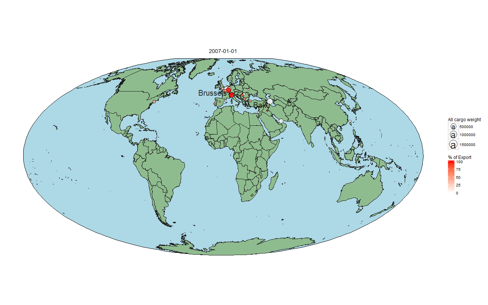

We love travel. We love air traffic management and data science even more. It goes without saying how excited we got when we’ve seen this challenge-who cared about the Public holiday in Hungary when we got air traffic patterns to visualize?!


# Getting started

First let's load all the packages needed for the script below. We use [pacman](https://cran.r-project.org/web/packages/pacman/vignettes/Introduction_to_pacman.html), a very elegant wrapper package by Tyler Rinker.  

```{r initialization, tidy = TRUE, include=FALSE}
if (!"pacman" %in% installed.packages()) install.packages("pacman")
pacman::p_load(devtools, xlsx, stringi, ggmap, plyr, sp, maps, rgdal, rgeos, mapproj, qdap, png, grid, ggthemes, ggplot2)

if (!"gganimate" %in% installed.packages()) devtools::install_github("dgrtwo/gganimate")
library(gganimate)
if (!"plotly" %in% installed.packages()) devtools::install_github("ropensci/plotly")
library(plotly)
```

As we immediately jumped at the chance, the xlsx data file still had its mistakes. Thus, we firstly corrected those by recoding the Hungarian labels to English. Although the xlsx2 command is significantly faster than the xlsx (though requires more setup), it was still faster to use a csv for prototyping, so we generated one.

```{r setup, tidy = TRUE,  include=FALSE, echo=FALSE}
options(java.parameters = "-Xmx4000m")

if (file.exists("BUD flights 2007-2012.csv")){
  df <- read.csv("BUD flights 2007-2012.csv", colClasses = c(rep("character", 7),
                                                              "Date",
                                                              "numeric",
                                                              rep("character", 3),
                                                              rep("numeric", 4)))
} else {
  recodeR <- function(data, oldvalue, newvalue) {
      # create the return vector
      oldvalue <- c(as.character(oldvalue))
      newvalue <- c(as.character(newvalue))
      data <- c(as.character(data))
      newvec <- data
      # put recoded values into the correct position in the return vector
      for (i in unique(oldvalue)) newvec[data == i] <- newvalue[oldvalue == i]
      newvec
  }
  
  
  # read the Hungarian version because the English was messed up
  df <- read.xlsx2("BUD flights 2007-2012.xlsx", sheetIndex = 2,
                   colClasses = c(rep("character", 7),
                                    "Date",
                                    "numeric",
                                    rep("character", 3),
                                    rep("numeric", 4)), 
                   encoding="UTF-8")
  colNamesDict <- read.xlsx("BUD flights 2007-2012.xlsx", sheetIndex = 3, encoding="UTF-8")
  destinationDict <- read.xlsx("BUD flights 2007-2012.xlsx", sheetIndex = 4, encoding="UTF-8")
  countryDict <- read.xlsx("BUD flights 2007-2012.xlsx", sheetIndex = 7, encoding="UTF-8")
  colNamesDict$English <- gsub(" ",".",colNamesDict$English)
  colnames(df) <- recodeR(colnames(df),colNamesDict$Hungarian, colNamesDict$English)
  df$COMMERCIAL.FLAG <- recodeR(df$COMMERCIAL.FLAG,colNamesDict$Hungarian, colNamesDict$English)
  df$FLIGH.DIRECTION <- recodeR(df$FLIGH.DIRECTION,colNamesDict$Hungarian, colNamesDict$English)
  df$FLIGHT.TYPE <- recodeR(df$FLIGHT.TYPE,colNamesDict$Hungarian, colNamesDict$English)
  df$DESTINATION <- recodeR(df$DESTINATION, destinationDict$Hujngarian, destinationDict$English)
  df$COUNTRY <- recodeR(df$COUNTRY, countryDict$Hungarian, countryDict$English)
  
  write.csv(df, "BUD flights 2007-2012.csv", row.names=FALSE)
}
```

# Finding us on the map

Finally, we were able to get started. The first thing that popped into our heads was to get a glimpse on where goods and people travel to/from Budapest. 
In order to do this, first we had to find us on the map.

There are several options for spatial data visualization in R, here we are going to show a selection of these. 
First let's read the longitude and lattitude coordinates of the different countries [citation](https://www.r-bloggers.com/r-beginners-plotting-locations-on-to-a-world-map/), this is the first step and is common for all the packages we tried. We downloaded the coordinates of airports and countries as well. Of note, this can be used pretty flexible, i.e. you can download the coordinates of pretty much everything. Again, because downloading each time 500+ coordinates is rather time consuming we preserved the output in csv format for prototyping.


```{r readLocations, echo=FALSE, tidy=TRUE, warning=FALSE, message=FALSE}
locationsCountryFileName <- "locations_country_lon_lat.csv"

if (file.exists(locationsCountryFileName)){
  locationCountryCoordinates <- read.csv(locationsCountryFileName, header = TRUE)
} else {
  destinationCountries <- unique(as.character(df$COUNTRY))
  locationCountryCoordinates <- geocode(destinationCountries)
  locationCountryCoordinates$COUNTRY <- destinationCountries
  write.csv(locationCountryCoordinates, locationsCountryFileName)
}

locationsCityFileName <- "locations_cities_lon_lat.csv"

if (file.exists(locationsCityFileName)){
  locationCityCoordinates <- read.csv(locationsCityFileName)
} else {
  destinationCities <- unique(as.character(df$DESTINATION))
  locationCityCoordinates <- geocode(destinationCities)
  locationCityCoordinates$DESTINATION <- destinationCities
  write.csv(locationCityCoordinates, locationsCityFileName)
}

locationCountryCoordinates$X <- NULL
locationCityCoordinates$X <- NULL

locationCityCoordinates <- plyr::rename(locationCityCoordinates, c("lon"="lonCi", "lat"="latCi"))
df <- merge(df, locationCityCoordinates)
locationCountryCoordinates <- plyr::rename(locationCountryCoordinates, c("lon"="lonCo", "lat"="latCo"))
df <- merge(df, locationCountryCoordinates)
```

# Visualization of cargo flow

If you click on the bubbles you can get more information on the places. Hong Kong seems to be a reasonable choice for our imports and it wins this hands down. 

```{r Cargo_staticVis, tidy=TRUE, warning=FALSE, message=FALSE, echo=TRUE}
df2 <- aggregate(CARGO.WEIGHT ~ DESTINATION + FLIGH.DIRECTION, df, sum)
df2$sizeCARGO.WEIGHT <- df2$CARGO.WEIGHT  # this is going to be the size of the markers
df2$colorCARGO.WEIGHT <- df2$CARGO.WEIGHT # this going to be the colour of the markers

df2[df2$FLIGH.DIRECTION == "Incoming","colorCARGO.WEIGHT"] <- 0

df2 <- aggregate(. ~ DESTINATION, df2[ ,c(1,4:5)], sum)
df2 <- df2[df2$sizeCARGO.WEIGHT > 0, ] 
df2$colorCARGO.WEIGHT <- round(df2$colorCARGO.WEIGHT / df2$sizeCARGO.WEIGHT *100)

  
df2 <- merge(df2, locationCityCoordinates)

gg <- ggplot(world.cities, aes(long, lat)) +
  borders(regions = ".", fill = "grey90") 
gg <- gg + geom_point(data = df2, 
                 aes(x = lonCi, y = latCi, text=paste(DESTINATION,"<br>All cargo:",sizeCARGO.WEIGHT, "<br>Export - Import:", colorCARGO.WEIGHT),
                     size = sizeCARGO.WEIGHT, color = colorCARGO.WEIGHT), 
                 alpha = 0.9)
gg <- gg + scale_colour_gradient(low = "blue", high = "red",
                                              guide = guide_colourbar(title = "% of Export",
                                                                      title.position = "top",
                                                                      direction = "horizontal", 
                                                                      label = FALSE))
gg <- gg + labs(x=NULL, y=NULL, size='Cargo weight' )
gg <- gg + theme_map()
ggplotly(tooltip = c("text"))
```

While this picture is worth a thousand words, the export/import have a time dynamic as well. Hence, an animation to create was indispensable here. Can you catch when we imported to Japan?

First we were interested in the cargo flow. We displayed a world map using the [Mollweide projection](https://en.wikipedia.org/wiki/Mollweide_projection). This projection is used because it emphasizes the accuracy of relative sizes of land and sea parts. The method used here is based on the example and polygon of [Bob Rudis](http://stackoverflow.com/a/27901570/5360901). For the animation we used the [gganimate](https://www.ggplot2-exts.org/gganimate.html) package by David Robinson. 

Because we were working on Windows, setting up ffmepeg and imagemagick required a little effort. With imagemagick you are better installing it under C:\ immediately to avoid "space" problems in the path. ffmpeg needs to be added to the path, it does not add itself by default.


```{r staticWorldMap, tidy=TRUE, warning=FALSE, message=FALSE, echo=TRUE}
world <- readOGR("ne_50m_admin_0_countries.geojson", "OGRGeoJSON")
outline <- bbox(world)
outline <- data.frame(xmin=outline["x","min"],
                      xmax=outline["x","max"],
                      ymin=outline["y","min"],
                      ymax=outline["y","max"])

world <- fortify(world)

points <- data.frame(lon=c(-98.35, 134.21), lat=c(39.5, -25.36))

cargo_by_month <- df
cargo_by_month$sizeCARGO.WEIGHT <- cargo_by_month$CARGO.WEIGHT
cargo_by_month$colorCARGO.WEIGHT <- cargo_by_month$CARGO.WEIGHT
cargo_by_month$colorCARGO.WEIGHT[cargo_by_month$FLIGH.DIRECTION == 'Incoming'] <- cargo_by_month$colorCARGO.WEIGHT[cargo_by_month$FLIGH.DIRECTION == 'Incoming']*-1
cargo_by_month <- aggregate(cbind(colorCARGO.WEIGHT, sizeCARGO.WEIGHT) ~ DESTINATION + DATE, cargo_by_month, sum)
cargo_by_month$colorCARGO.WEIGHT <- cargo_by_month$colorCARGO.WEIGHT / cargo_by_month$sizeCARGO.WEIGHT
cargo_by_month <- cargo_by_month[cargo_by_month$sizeCARGO.WEIGHT > 0, ]

cargo_by_month <- merge(cargo_by_month, locationCityCoordinates)

if (!file.exists("cargo_weights.gif")) {
  gg <- ggplot()
  # first let's create the sea
  gg <- gg + geom_rect(data=outline, 
                       aes(xmin=xmin, xmax=xmax, ymin=ymin, ymax=ymax), 
                       color=1, fill="lightblue", size=0.3)
  # then let the land emerge
  gg <- gg + geom_map(data=world, map=world,
                      aes(x=long, y=lat, map_id=id), 
                      fill="darkseagreen", color="gray10", size=0.3)
  # then let people populate the Earth
  gg <- gg + geom_point(aes(x=lonCi, y=latCi, size=sizeCARGO.WEIGHT, 
                            frame=DATE, fill=colorCARGO.WEIGHT),
                        data=cargo_by_month, colour="black", pch=21, alpha=0.8) + 
    scale_size(range = c(2, 10))
  gg <- gg + geom_text(aes(x=lonCi, y=latCi, label=DESTINATION,
                            size=sizeCARGO.WEIGHT, frame=DATE), 
                        data=cargo_by_month[cargo_by_month$sizeCARGO.WEIGHT > 5e5, ],
                       alpha=0.8, vjust = 1, hjust = 1)
  gg <- gg + scale_fill_gradient2(low = "blue", mid = "white", high = "red", guide = "colorbar")
  
  gg <- gg + coord_map("mollweide") 
  
  # make the plot pretty
  gg <- gg + theme_bw()
  gg <- gg + labs(x=NULL, y=NULL, size='All cargo weight', fill='Export - Import difference')
  gg <- gg + theme(panel.grid=element_blank(),
                   #legend.position="none", 
                   panel.border=element_blank(),
                   axis.ticks=element_blank(),
                   axis.text=element_blank()) 
  print(gg)
  gg_animate(gg, interval = 0.5, filename = "cargo_weights.gif", ani.width=1280, ani.height=800) 
}
```



http://relevantmisc.com/ggplot/instagram/2016/02/14/ig-over-time/
http://2.bp.blogspot.com/-pogyMKoowkc/VSU7kXa2paI/AAAAAAAAFOM/dyb9WWBscmk/s1600/mapproj_cheatsheet.png

# Visualization of passenger flow

Secondly, we plotted which destinations are the most represented in the data. To make the figure more meaningful, we decided to plot the difference of these two values to get the airports which were more likely to be destination places from BUD and the ones from where BUD received more passengers. It seems that many planes went to the UK, Germany and France (and then presumably to the US too).

```{r Passenger_flow, tidy=TRUE, warning=FALSE, message=FALSE, echo=TRUE}
df2 <- aggregate(NBR.OF.PASSENGERS ~ DESTINATION + FLIGH.DIRECTION, df, sum)
df2$colorNBR.OF.PASSENGERS <- df2$NBR.OF.PASSENGERS # this going to be the colour of the markers
df2$sizeNBR.OF.PASSENGERS <- df2$NBR.OF.PASSENGERS  # this is going to be the size of the markers

df2[df2$FLIGH.DIRECTION == "Incoming","colorNBR.OF.PASSENGERS"] <- df2[df2$FLIGH.DIRECTION == "Incoming","colorNBR.OF.PASSENGERS"] *-1

df2 <- aggregate(. ~ DESTINATION, df2[ ,c(1,4:5)], sum)
df2 <- df2[df2$sizeNBR.OF.PASSENGERS > 0, ] 

df2 <- merge(df2, locationCityCoordinates)

map <- get_map(location = 'Serbia', zoom = 4, maptype = "roadmap")

gg <- ggmap(map)
gg <- gg + geom_point(data = df2, 
                 aes(x = lonCi, y = latCi, size = sizeNBR.OF.PASSENGERS, 
                     fill = colorNBR.OF.PASSENGERS) , colour="black", pch=21) 
gg <- gg + theme_bw() + scale_fill_gradient2(low = "blue", mid = "white", high = "red", guide = "colorbar")
gg <- gg + labs(x=NULL, y=NULL) 
gg <- gg + theme(panel.grid=element_blank(),
                 #legend.position="none", 
                 panel.border=element_blank(),
                 axis.ticks=element_blank(),
                 axis.text=element_blank())
print(gg)
```

This looks very interesting, however, there are a lot of destinations. Attaching text annotations to all of them would have made the graph crowded, so we've rather opted for an interactive visualization. [Plotly](https://plot.ly/) recently made available its mapping toolkit along with the offline version of their D3.js based plotting solution. We used jet colormap to display the difference between incoming and outgoing passenger numbers to a given airport. The size of the markers is proportionate to the sum passengers in that direction. The plot is zoomable & hoverable, this way even the smaller airports can be seen quite well. 

```{r, zoomable Passanger_flow, tidy=TRUE, warning=FALSE, message=FALSE, echo=TRUE}
df2$hover <- with(df2, paste("Destination: ", DESTINATION))
df2$scaled_sizeNBR.OF.PASSENGERS <- df2$sizeNBR.OF.PASSENGERS / 30000
df2$Difference <- df2$colorNBR.OF.PASSENGERS

# marker styling
m <- list(
  colorbar = list(title = "Millions USD"),
  size = ~scaled_sizeNBR.OF.PASSENGERS, 
  opacity = 0.8, 
  symbol = 'circle'
)

# color of markers
jet <- c("#00007F", "blue", "#007FFF", "cyan", "#7FFF7F", "yellow", "#FF7F00", "red", "#7F0000")

# axis styling
ax <- list(
  title = "",
  zeroline = FALSE,
  showline = FALSE,
  showticklabels = FALSE,
  showgrid = FALSE
)

# geo styling
g <- list(
  scope = 'world',
  projection = list(type = 'albers europe'),
  showland = TRUE,
  lonaxis = list(range = c(-20,50)),
  lataxis = list(range = c(20,70)),
  landcolor = toRGB("gray65"),
  subunitcolor = toRGB("white"),
  countrycolor = toRGB("white"),
  countrywidth = 1,
  subunitwidth = 1
)

plot_ly(df2, lat = ~latCi, lon = ~lonCi, text = ~hover, color = ~Difference,
        type = 'scattergeo', locationmode = 'country names', mode = 'markers',
        colors = jet, marker = m) %>% 
  layout(title = 'Incoming/outgoing passengers of Liszt Ferenc Airport', geo = g, xaxis = ax, yaxis = ax)
```


http://stackoverflow.com/questions/37329433/how-to-build-simple-google-chart-in-shiny

https://trinkerrstuff.wordpress.com/2013/05/11/animations-understood-5/


#Air traffic movement vs airplane load

Now that we assessed the habits of the passengers, we've gotten to the best part of the challenge: to see how BUD handled the demand! We are aware of a lot of things that could have affected the travelling mood and the airport operations (e.g. budget companies, adverse weather, financial crisis etc.). We assumed that the MALÉV grounding must also have had its implication on the performance at BUD. Thus, we were intrigued to see how the general trend changed over the months regarding the air traffic movements at the airport and the load of the planes (nbr of passengers/nbr of seats). 

After the time series decomposition the trend component was used instead of the seasonal since the summer peaks and winter lows had not taken us by surprise. 

The figure shows that whilst the number of movements (i.e. the number of takeoffs and landings) decreased, the aircraft load has gradually increased. By the time of the Malév bankruptcy, you can see that some efforts must have been made to minimize its potential negative impact. 

So how could the airlines react to such event? The figure suggests that the load factor (utilization of flights) strongly improved while the number of movements (takeoff/landing) reduced. This leads us to the conclusion that for instance, airlines should have operated larger aircrafts to fill the void.


```{r, Airport_demand, tidy=TRUE, warning=FALSE, message=FALSE, echo=TRUE}
df$plane_load <-df$NBR.OF.PASSENGERS/df$SEAT.CAPACITY
loads <- cbind(aggregate(plane_load ~ DATE, df, mean), # load of an average plane
                    aggregate(NBR.OF.FLIGHTS ~ DATE, df, sum)) # load of the airport in the given interval

airportLoad <- ts(loads$NBR.OF.FLIGHTS, start = c(2007, 1), end = c(2012, 6), frequency = 12) 
airplaneLoad <- ts(loads$plane_load, start = c(2007, 1), end = c(2012, 6), frequency = 12) 

#time-series decomposition to get the trend component
times <- sort(unique(df$DATE))
airportLoadComps <- stl(airportLoad, s.window = "period")$time.series
airportLoadComps <- as.data.frame(airportLoadComps)
colnames(airportLoadComps) <- paste(colnames(airportLoadComps), "Airport", sep = "")
airportLoadComps$DATE <- times
airplaneLoadComps <- stl(airplaneLoad, s.window = "period")$time.series
airplaneLoadComps <- as.data.frame(airplaneLoadComps)
colnames(airplaneLoadComps) <- paste(colnames(airplaneLoadComps), "Airplane", sep = "")
airplaneLoadComps$DATE <- times

loads <- merge(airplaneLoadComps, airportLoadComps)

loads[ ,2:7] <- loads[ ,2:7] - sapply(sapply(loads[1:10,2:7], mean), rep, 66) # baseline correction

url_dl(url="https://d13yacurqjgara.cloudfront.net/users/618902/screenshots/1653451/building_changi-01_1x.png")
airport_img <- readPNG("building_changi-01_1x.png")
airport <- rasterGrob(airport_img)
url_dl(url="http://92.48.119.71/wp-content/uploads/2015/09/Airplane-Icon.png")
airplane_img <- readPNG("Airplane-Icon.png")
airplane <- rasterGrob(airplane_img)

last_point = dim(loads)[1]

ggplot(data=loads, aes(x=DATE)) +
  geom_line(aes(y=scale(trendAirplane, center = FALSE)), size=1, color = "red") + 
  geom_line(aes(y=scale(trendAirport, center = FALSE)), size=1, color = "blue") + 
  annotation_custom(airport, 
                    xmin=as.numeric(loads$DATE[last_point-10]), 
                    xmax=as.numeric(loads$DATE[last_point]), 
                    ymin=scale(loads$trendAirport, center = FALSE)[last_point], 
                    ymax=scale(loads$trendAirport, center = FALSE)[last_point] + 1) +
  annotation_custom(airplane, 
                    xmin=as.numeric(loads$DATE[last_point-10]), 
                    xmax=as.numeric(loads$DATE[last_point]), 
                    ymin=scale(loads$trendAirplane, center = FALSE)[last_point] -1, 
                    ymax=scale(loads$trendAirplane, center = FALSE)[last_point] ) +
  geom_rangeframe() +  
  theme_tufte() + labs(x="Time", y="Load of airport/airplane")
```

http://svg-to-wkt.linfiniti.com/

https://www.stat.auckland.ac.nz/~paul/Reports/Rlogo/Rlogo.html


